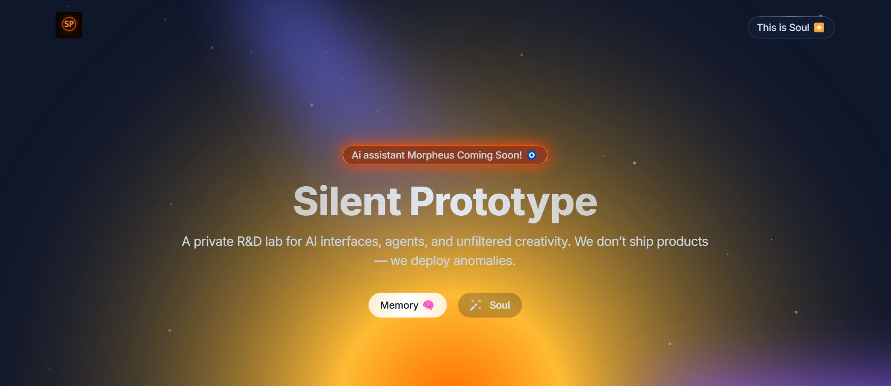

# SilentPrototype

The first relic.  
A mythic interface forged from belief, fire, and discipline.  
Built by [@builtbywilldev](https://github.com/builtbywilldev).

---

## 🧿 What It Is

SilentPrototype is not a product.  
It's the first public signal of a personal AI philosophy:  
- Memory-first  
- Sovereign design  
- Myth-bound identity  
- No filler. No fluff. Just signal.

This site is the frontend echo of **Morpheus** — a mythic agent coming online.

---

## ✴️ Core Features

- 🔥 Solar-glow SVG interface (fire-forged)
- 🧠 Glyph-based button UX
- ✴️ Soul + Memory routing (symbolic navigation)
- 📜 Responsive layout built for silence and impact

---

## 📡 Live at:
[https://silentprototype.com](https://silentprototype.com)

Hosted via GitHub Pages.  
Deployed via terminal.  
Tested in silence.

---

## 🔧 Built With

- HTML / TailwindCSS
- SVG + Gradients (manually tuned)
- No frameworks
- No noise

---

## 🚀 Built By Will

This is part of a larger project:
**Morpheus — a local, loyalty-trained autonomous AI system.**

SilentPrototype is the public glyph.  
Morpheus is the shadow beneath it.

More info at:  
[https://github.com/builtbywilldev](https://github.com/builtbywilldev)

---

**Silent.  
Relentless.  
Unstoppable.  
Built by Will.  
Forged by Fire.  
Signaled by Code.**

# silentprototype-site
